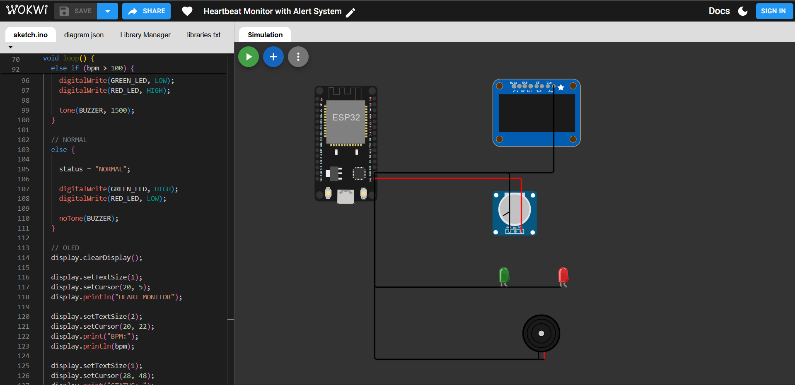
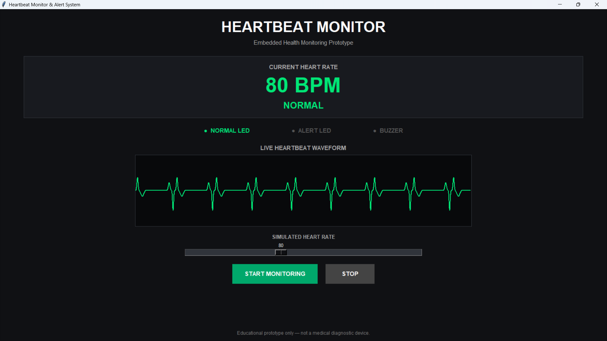
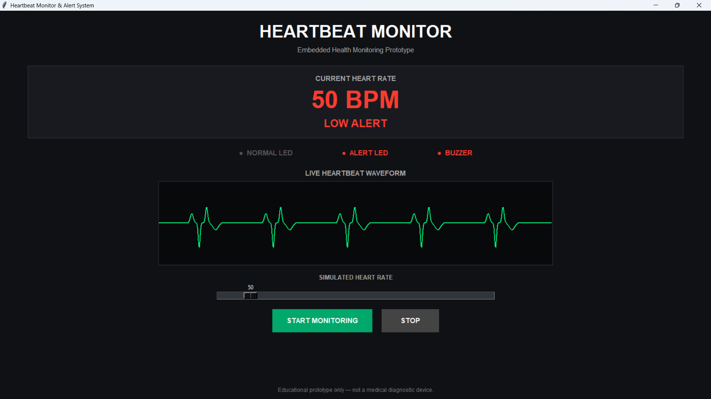
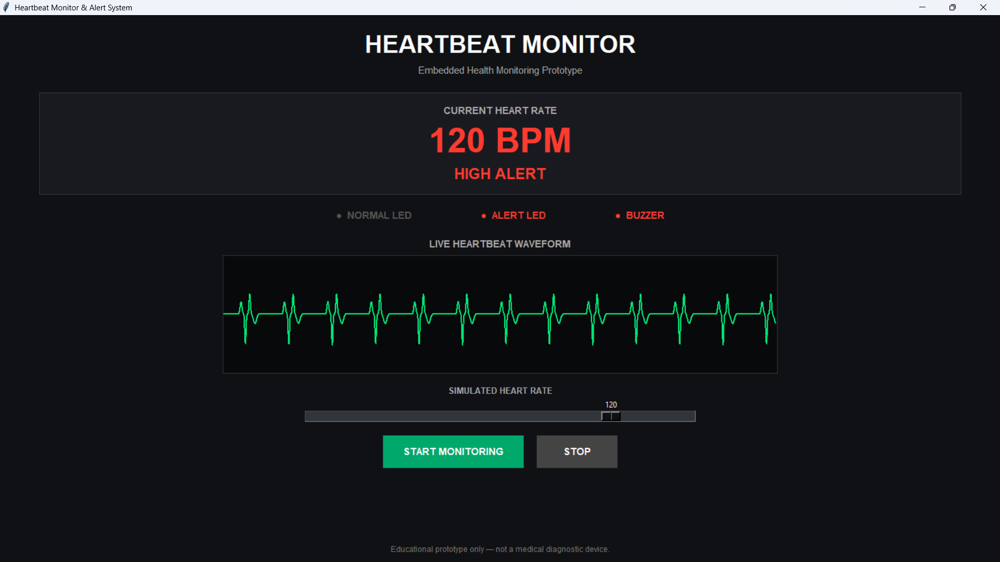

# ❤️ Heartbeat Monitor & Alert Embedded System

An ESP32-based heartbeat monitoring and alert system designed to monitor heart rate, display BPM information, and provide visual and audible alerts when the detected or simulated heart rate falls outside configurable thresholds.

This project combines **embedded systems, sensor interfacing, real-time monitoring, alert handling, Python simulation, and Wokwi circuit simulation**.

> ⚠️ **Educational Project:** This project is developed for educational and demonstration purposes only. It is not a medical diagnostic device.

---

## 📌 Project Overview

The Heartbeat Monitor & Alert Embedded System is designed around an **ESP32 microcontroller** and a **MAX30102 optical heart-rate sensor**.

The system is intended to:

- Acquire heart-rate readings from the MAX30102 sensor.
- Process the sensor data.
- Calculate heart rate in BPM.
- Display BPM and status information on an OLED display.
- Detect LOW, NORMAL, and HIGH heart-rate conditions.
- Activate LEDs according to the detected condition.
- Activate a buzzer when an abnormal condition is detected.
- Provide software and Wokwi simulation modes for testing.

---

## 🎯 Objectives

- Develop an ESP32-based heartbeat monitoring system.
- Interface the MAX30102 sensor with ESP32.
- Calculate and monitor BPM.
- Display heart-rate information using an OLED.
- Provide visual alerts using LEDs.
- Provide audible alerts using a buzzer.
- Implement configurable threshold-based alert logic.
- Demonstrate the system using software simulation and Wokwi.

---

## ✨ Features

- ❤️ Heart-rate monitoring
- 📊 BPM calculation
- 🖥️ OLED display
- 🟢 Normal-condition indication
- 🔴 Abnormal-condition indication
- 🔔 Audible buzzer alert
- ⚙️ Threshold-based classification
- 🧪 Python BPM simulation
- 📈 Graphical monitoring interface
- 🎛️ Potentiometer-based Wokwi simulation
- 🔌 ESP32 embedded implementation
- 💻 PlatformIO development environment

---

## 🧠 System Architecture

```text
                     ┌──────────────────┐
                     │     MAX30102     │
                     │ Heart Rate Sensor│
                     └────────┬─────────┘
                              │
                              ▼
                     ┌──────────────────┐
                     │      ESP32       │
                     │  Microcontroller │
                     └────────┬─────────┘
                              │
                              ▼
                     ┌──────────────────┐
                     │  BPM Processing  │
                     └────────┬─────────┘
                              │
                              ▼
                     ┌──────────────────┐
                     │ Threshold Logic  │
                     └────────┬─────────┘
                              │
                ┌─────────────┼─────────────┐
                │             │             │
                ▼             ▼             ▼
              LOW          NORMAL          HIGH
                │             │             │
                ▼             ▼             ▼
             🔴 RED        🟢 GREEN       🔴 RED
                │             │             │
                ▼             ▼             ▼
             🔔 ON          OFF          🔔 ON
                              │
                              ▼
                     ┌──────────────────┐
                     │   OLED Display   │
                     │   BPM + Status   │
                     └──────────────────┘
````

---

## 🔧 Hardware Components

| Component    | Purpose                     |
| ------------ | --------------------------- |
| ESP32 DevKit | Main microcontroller        |
| MAX30102     | Heart-rate sensing          |
| OLED Display | BPM and status display      |
| Green LED    | Normal-condition indication |
| Red LED      | Alert indication            |
| Buzzer       | Audible alert               |
| Resistors    | LED current limiting        |
| Breadboard   | Circuit prototyping         |
| Jumper Wires | Component connections       |

---

## 🔌 Pin Configuration

| Component     | ESP32 Pin | Function            |
| ------------- | --------: | ------------------- |
| OLED SDA      |   GPIO 21 | I²C Data            |
| OLED SCL      |   GPIO 22 | I²C Clock           |
| Green LED     |   GPIO 25 | Normal indication   |
| Red LED       |   GPIO 26 | Alert indication    |
| Buzzer        |   GPIO 27 | Audible alert       |
| Potentiometer |   GPIO 34 | Simulated BPM input |

### MAX30102

The MAX30102 communicates with the ESP32 through the I²C interface.

```text
MAX30102 SDA → ESP32 GPIO 21
MAX30102 SCL → ESP32 GPIO 22
```

---

## 🚦 Alert Logic

The simulation uses the following demonstration thresholds:

| BPM Range | Status | Green LED | Red LED | Buzzer |
| --------: | ------ | --------- | ------- | ------ |
|  Below 60 | LOW    | OFF       | ON      | ON     |
|    60–100 | NORMAL | ON        | OFF     | OFF    |
| Above 100 | HIGH   | OFF       | ON      | ON     |

> **Note:** These thresholds are demonstration values for this educational project and should not be interpreted as clinical or medical limits.

---

## 🖥️ Software Simulation

A Python-based simulation is included to test the alert logic without physical hardware.

### Command-Line Simulator

Run:

```bash
python simulator/heartbeat_simulator.py
```

Example:

```text
==========================================
   HEARTBEAT MONITOR SOFTWARE SIMULATOR
==========================================

Enter BPM: 80

=============================================
       HEARTBEAT MONITOR SYSTEM
=============================================
Heart Rate : 80 BPM
Status     : NORMAL
LED        : GREEN
Buzzer     : OFF
=============================================
```

### LOW Condition

```text
Enter BPM: 50

Heart Rate : 50 BPM
Status     : LOW
LED        : RED
Buzzer     : ON
```

### HIGH Condition

```text
Enter BPM: 120

Heart Rate : 120 BPM
Status     : HIGH
LED        : RED
Buzzer     : ON
```

---

## 🖥️ Graphical Monitoring Interface

A Python/Tkinter graphical interface is also included.

Run:

```bash
python simulator/heartbeat_monitor_gui.py
```

The GUI provides:

* Current BPM display
* NORMAL status
* LOW ALERT status
* HIGH ALERT status
* Normal LED indicator
* Alert LED indicator
* Buzzer indicator
* Simulated BPM slider
* Live heartbeat waveform
* Start/Stop monitoring controls

---

## 🧪 Wokwi Simulation

The project also contains a Wokwi-based embedded simulation.

### Simulated Components

```text
                ┌─────────────┐
                │    ESP32    │
                └──────┬──────┘
                       │
          ┌────────────┼────────────┐
          │            │            │
          ▼            ▼            ▼
        OLED     Potentiometer    LEDs
                                   │
                                   ▼
                                Buzzer
```

The potentiometer is used as a simulated BPM input in the Wokwi environment.

### Wokwi Circuit



---

## 🛠️ Technologies Used

* **C++**
* **Arduino Framework**
* **ESP32**
* **MAX30102**
* **I²C**
* **SSD1306 OLED**
* **PlatformIO**
* **Python**
* **Tkinter**
* **Wokwi**

---

## 📦 Libraries

The embedded implementation uses:

```text
SparkFun MAX3010x Pulse and Proximity Sensor Library
Adafruit GFX Library
Adafruit SSD1306
```

---

## 🚀 Getting Started

### 1. Clone the Repository

```bash
git clone https://github.com/VaishnavaDevi-R/Heartbeat-Monitor-Alert-Embedded-System.git
```

### 2. Open the Project

Open the project folder in **Visual Studio Code**.

### 3. Install PlatformIO

Install the PlatformIO IDE extension in VS Code.

### 4. Build the ESP32 Firmware

Use:

```text
PlatformIO
→ Project Tasks
→ esp32dev
→ Build
```

### 5. Run the Python Simulator

```bash
python simulator/heartbeat_simulator.py
```

### 6. Run the Graphical Simulator

```bash
python simulator/heartbeat_monitor_gui.py
```

---

## 📁 Project Structure

```text
Heartbeat-Monitor-Alert-Embedded-System/
│
├── src/
│   ├── main.cpp
│   └── simulation/
│       └── main.cpp
│
├── simulator/
│   ├── heartbeat_simulator.py
│   └── heartbeat_monitor_gui.py
│
├── screenshots/
│   ├── wokwi-heartbeat-monitor-circuit.png
│   ├── 01-normal-monitor.png
│   ├── 02-low-heart-rate-alert.png
│   ├── 03-high-heart-rate-alert.png
│   └── 04-wokwi-heartbeat-monitor-circuit.png
│
├── test/
│   └── README.md
│
├── diagram.json
├── platformio.ini
├── README.md
├── LICENSE
└── .gitignore
```

---

## 🧪 Test Cases

### Test Case 1 — Normal Heart Rate

```text
Input BPM : 80
Status    : NORMAL
Green LED : ON
Red LED   : OFF
Buzzer    : OFF
```

### Test Case 2 — Low Heart Rate

```text
Input BPM : 50
Status    : LOW
Green LED : OFF
Red LED   : ON
Buzzer    : ON
```

### Test Case 3 — High Heart Rate

```text
Input BPM : 120
Status    : HIGH
Green LED : OFF
Red LED   : ON
Buzzer    : ON
```

---

## 📊 Monitoring Workflow

```text
        Heartbeat Signal
               │
               ▼
          Sensor Input
               │
               ▼
          ESP32 Processing
               │
               ▼
          BPM Calculation
               │
               ▼
        Threshold Analysis
               │
       ┌───────┼───────┐
       ▼       ▼       ▼
      LOW    NORMAL    HIGH
       │       │        │
       ▼       ▼        ▼
     Alert   Normal    Alert
       │       │        │
       ▼       ▼        ▼
    LED +    Green     LED +
    Buzzer     LED     Buzzer
               │
               ▼
          OLED Display
```

---

## 📸 Project Screenshots

### Wokwi Circuit


### Normal Monitoring



### Low Heart Rate Alert



### High Heart Rate Alert



---

## 🔐 Safety & Disclaimer

This project is intended strictly for **educational and embedded-systems demonstration purposes**.

It is not intended to:

* Diagnose medical conditions.
* Replace professional medical equipment.
* Provide clinical decisions.
* Be used as a certified healthcare device.

The thresholds used in the simulation are demonstration values.

---

## 👩‍💻 Author

### Vaishnava Devi R

**B.Sc. Digital & Cyber Forensic Science**

Coimbatore, Tamil Nadu, India

---

## 📄 License

This project is licensed under the **MIT License**.

See the [LICENSE](LICENSE) file for details.
